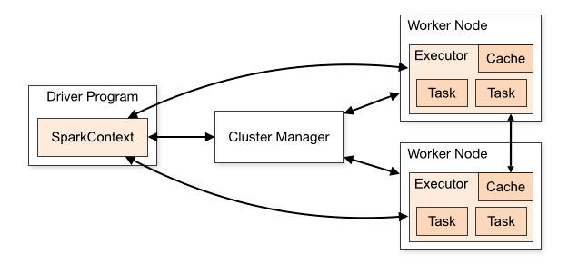
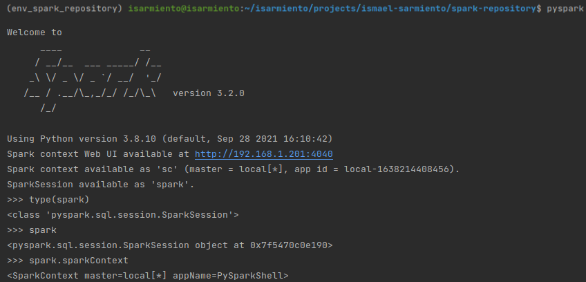
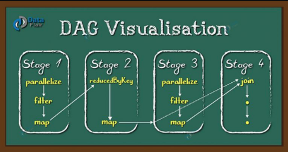
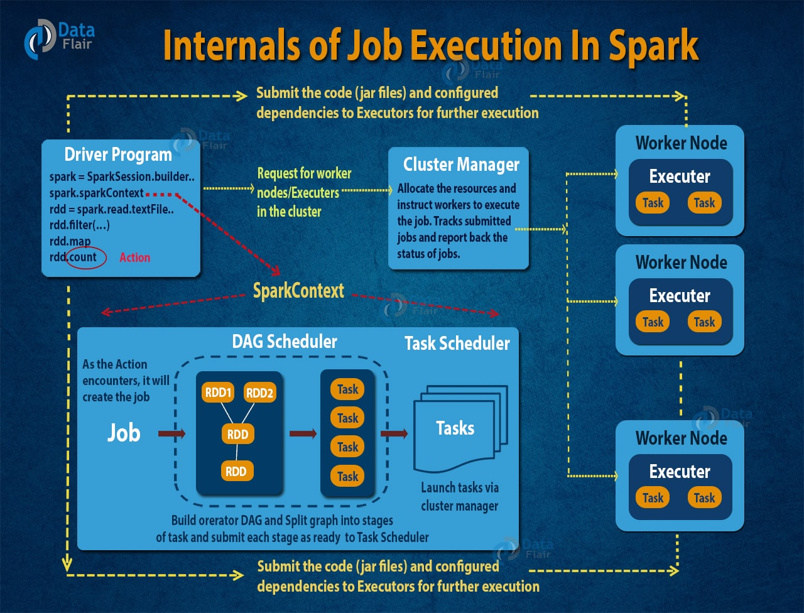
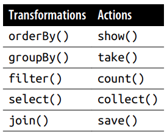
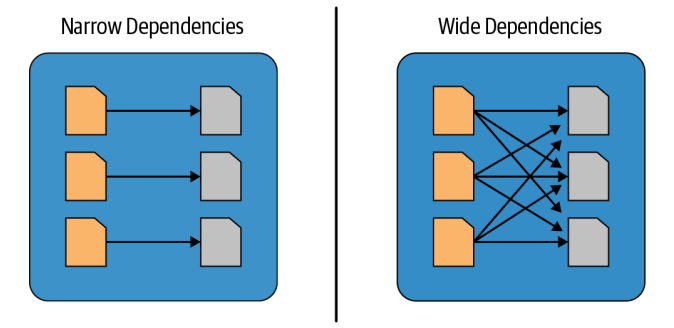

# [Apache Spark](https://projects.apache.org/project.html?spark)

## Arquitectura

### Diagrama General

* Las `spark-applications` se ejecutan como conjuntos independientes de procesos en un clúster, coordinados por el
  `spark-context` del `driver-program`.
* Para ejecutarse en un clúster, `spark-context` puede conectarse a varios tipos de administradores de clúster (ya sea
  el administrador de clúster independiente de Spark [`standalone-cluster-manager`], Mesos, YARN o Kubernetes), que
  asignan recursos entre `applications`.
* Una vez conectado, Spark adquiere `executors` en los nodos del clúster, que son procesos que ejecutan cálculos y
  almacenan datos para su `application`.
* A continuación, envía el código de su `application` (definido por archivos JAR o Python pasados al `spark-context`) a
  los `executors`.
* Finalmente, `spark-context` envía `tasks` hacia los `executors` para que las ejecuten.

* Cada `applications` tiene sus propios procesos `executors`, que permanecen activos durante toda la `applications` y
  ejecutan
  `tasks` en varios subprocesos. Esto tiene la ventaja de aislar las `applications` entre sí, tanto en el lado de la
  programación (cada controlador programa sus propias `tasks`) como en el lado del ejecutor (las `tasks` de diferentes
  `applications` se ejecutan en diferentes JVM). Sin embargo, también significa que los datos no se pueden compartir
  entre diferentes `spark-applications`  (instancias de `spark-context`) sin escribirlos en un sistema de almacenamiento
  externo.

* Spark es independiente del administrador del clúster subyacente. Siempre que pueda adquirir procesos `executors` y
  estos se comuniquen entre sí, es relativamente fácil ejecutarlo incluso en un administrador de clúster que también
  admita otras `applications` (e.g, Mesos / YARN / Kubernetes).

  

## Componentes

### Spark Application [`application`]

* Programa de usuario construido sobre Spark. Consta de un driver program y `executors` [`executors`] en el clúster.

### Spark Driver Program [`driver-program`]

* En el núcleo de cada `application` se encuentra el `driver-program`, el encargado de la creación del punto de acceso a
  spark: `spark-context` o `spark-session`
* Cuando se trabaja con la `spark-shell` el `driver-program` es parte de la shell y la `spark-session` se crea para
  usted con la configuración por defecto
  

### Spark Jobs [`jobs`]

* El `driver-program` convierte a la `application` en uno o más `jobs`. Luego, transforma cada trabajo en un `DAG`,
  este, en esencia es el plan de ejecución de spark, donde cada nodo dentro de un `DAG` podría ser una o varias `stages`
  de spark

  

### Spark Stages [`stages`]

* Como parte de los nodos `DAG`:

  

  las `stages` se crean en función de las operaciones que se pueden realizar en serie o en paralelo. No todas las
  operaciones de Spark pueden suceder en una sola `stage`, por lo que pueden dividirse en varias
  `stages`. A menudo, las `stages` se delinean en los límites de cálculo del operador, donde dictan la transferencia de
  datos entre los `executors` de spark.

  

### Spark Tasks [`tasks`]

* Cada `stage` se compone de `tasks` (una unidad de ejecución), que luego se federan/distribuyen en cada `executor` de
  Spark; cada `task` se asigna a un solo núcleo y funciona en una sola partición de datos. Como tal, un `executor` con
  16 núcleos puede tener 16 o más tasks que trabajan en 16 o más particiones en paralelo, lo que hace que la ejecución
  de las spark-tasks sean extremadamente paralelas.

  

## Diagrama General - Detallado

## Transformations, Actions and Lazy Evaluation

* Las operaciones de spark sobre datos distribuidos se pueden clasificar en dos tipos:
    * `transformations`: operaciones que transforman un `spark-df` en un nuevo `spark-df` sin alterar los datos
      originales, dándole la propiedad de inmutabilidad. Todas las transformaciones son evaluadas de forma `lazily`
      /diferida, es decir, que sus resultados no se computan de inmediato, sino que se registran o recuerdan como
      un `linaje`. Un `linaje`registrado permite a spark (en un momento posterior a su plan de ejecución) reorganizar,
      compensar u optimizar ciertas transformaciones en `stages` para una ejecución más eficiente.
    * `actions`: Una acción desencadena la `lazy-evaluation` de todas las transformaciones registradas y permite la
      ejecución de la `query-plan` de spark.

      

* Las acciones y transformaciones contribuyen a la `query-plan` de spark
* Si bien la `lazy-evaluation` permite que Spark optimice sus consultas al observar sus transformaciones encadenadas, el
  linaje y la inmutabilidad de los datos brindan tolerancia a fallos.
* Debido a que Spark registra cada transformación en su linaje y los DataFrames son inmutables entre las
  transformaciones, puede reproducir su estado original simplemente reproduciendo el linaje registrado, lo que le otorga
  resistencia en caso de fallos.

### Narrow and Wide Transformations

* Las transformaciones son operaciones que Spark evalúa de manera `lazy` (perezosa). Una gran ventaja del esquema de
  evaluación perezosa es que Spark puede inspeccionar su consulta computacional y determinar cómo puede optimizarla. La
  optimización se puede realizar uniendo o canalizando algunas operaciones y asignándolas a una `stage`, o dividiéndolas
  en `stages` determinando qué operaciones requieren `shuffle` mezcla o intercambio de datos entre clústeres.
* Las transformaciones se pueden clasificar en dependencias estrechas o dependencias
  amplias. `narrow or wide transformations`.
    * `narrow`: cualquier transformación en la que se pueda calcular una única partición de salida a partir de una única
      partición de entrada.
        * e.g: `filter() and contains()` representan transformaciones `narrow` estrechas porque pueden operar en una
          sola partición y producir la partición de salida resultante sin ningún intercambio de datos.
    * `wide`: cualquier transformación que requiera un intercambio de información entre particiones.
        * e.g: `groupBy() and orderBy()` le indican a Spark que realice transformaciones `wide` amplias, donde los datos
          de otras particiones se leen, combinan y escriben en el disco. Dado que cada partición tendrá su propio
          recuento de la palabra en su fila de datos, un recuento (groupBy()) forzará un `shuffle` de datos de cada una
          de las particiones del ejecutor en el clúster y (orderBy()) requiere de la salida de otras particiones para
          calcular la agregación final.

  

## FAQs
* [spark-submit](https://spark.apache.org/docs/latest/submitting-applications.html#launching-applications-with-spark-submit)
* [spark-context vs spark-session](https://sparkbyexamples.com/spark/sparksession-vs-sparkcontext/)
* [repartition-vs-coalesce](https://sparkbyexamples.com/spark/spark-repartition-vs-coalesce/)
  * **repartition**: se usa para aumentar o disminuir las particiones o redistribuir los datos de todas las
    particiones.
    Es una mezcla completa que conduce a una operación muy costosa cuando se trata de miles de millones y billones de
    datos.
  * **coalesce**: se usa solo para reducir la cantidad de particiones.Esta es una versión optimizada o mejorada de
    repartition()donde el movimiento de los datos a través de las particiones es menor usando coalesce.
* [master-urls-passed-to-spark](https://spark.apache.org/docs/latest/submitting-applications.html#master-urls)
  * <table class="table">
    <tbody><tr><th>Master URL</th><th>Meaning</th></tr>
    <tr><td> <code>local</code> </td><td> Run Spark locally with one worker thread (i.e. no parallelism at all). </td></tr>
    <tr><td> <code>local[K]</code> </td><td> Run Spark locally with K worker threads (ideally, set this to the number of cores on your machine). </td></tr>
    <tr><td> <code>local[K,F]</code> </td><td> Run Spark locally with K worker threads and F maxFailures (see <a href="configuration.html#scheduling">spark.task.maxFailures</a> for an explanation of this variable). </td></tr>
    <tr><td> <code>local[*]</code> </td><td> Run Spark locally with as many worker threads as logical cores on your machine.</td></tr>
    <tr><td> <code>local[*,F]</code> </td><td> Run Spark locally with as many worker threads as logical cores on your machine and F maxFailures.</td></tr>
    <tr><td> <code>local-cluster[N,C,M]</code> </td><td> Local-cluster mode is only for unit tests. It emulates a distributed cluster in a single JVM with N number of workers, C cores per worker and M MiB of memory per worker.</td></tr>
    <tr><td> <code>spark://HOST:PORT</code> </td><td> Connect to the given <a href="spark-standalone.html">Spark standalone
            cluster</a> master. The port must be whichever one your master is configured to use, which is 7077 by default.
    </td></tr>
    <tr><td> <code>spark://HOST1:PORT1,HOST2:PORT2</code> </td><td> Connect to the given <a href="spark-standalone.html#standby-masters-with-zookeeper">Spark standalone
            cluster with standby masters with Zookeeper</a>. The list must have all the master hosts in the high availability cluster set up with Zookeeper. The port must be whichever each master is configured to use, which is 7077 by default.
    </td></tr>
    <tr><td> <code>mesos://HOST:PORT</code> </td><td> Connect to the given <a href="running-on-mesos.html">Mesos</a> cluster.
            The port must be whichever one your is configured to use, which is 5050 by default.
            Or, for a Mesos cluster using ZooKeeper, use <code>mesos://zk://...</code>.
            To submit with <code>--deploy-mode cluster</code>, the HOST:PORT should be configured to connect to the <a href="running-on-mesos.html#cluster-mode">MesosClusterDispatcher</a>.
    </td></tr>
    <tr><td> <code>yarn</code> </td><td> Connect to a <a href="running-on-yarn.html"> YARN </a> cluster in
            <code>client</code> or <code>cluster</code> mode depending on the value of <code>--deploy-mode</code>.
            The cluster location will be found based on the <code>HADOOP_CONF_DIR</code> or <code>YARN_CONF_DIR</code> variable.
    </td></tr>
    <tr><td> <code>k8s://HOST:PORT</code> </td><td> Connect to a <a href="running-on-kubernetes.html">Kubernetes</a> cluster in
            <code>client</code> or <code>cluster</code> mode depending on the value of <code>--deploy-mode</code>.
            The <code>HOST</code> and <code>PORT</code> refer to the <a href="https://kubernetes.io/docs/reference/generated/kube-apiserver/">Kubernetes API Server</a>.
            It connects using TLS by default. In order to force it to use an unsecured connection, you can use
            <code>k8s://http://HOST:PORT</code>.
    </td></tr>
    </tbody></table>

## [Glossary](https://spark.apache.org/docs/latest/cluster-overview.html#glossary)

| Término  | Significado |
|---|---|
| application | Programa de usuario construido sobre Spark. Consta de un driver program y `executors` [`executors`] en el clúster. |
| driver-program | Proceso que ejecuta la función principal de la application y crea el spark-context |
| [spark-context](https://sparkbyexamples.com/spark/sparksession-vs-sparkcontext/#sparkcontext) | Objeto que proporciona un punto de entrada para interactuar con la funcionalidad subyacente de Spark y permite programar Spark mediante la api SparkRDD |
| [spark-session](https://sparkbyexamples.com/spark/sparksession-vs-sparkcontext/#sparksession) | Objeto que proporciona un punto de entrada para interactuar con la funcionalidad subyacente de Spark y permite programar Spark mediante la api de SparkSql. En una spark-shell interactiva, el spark-driver [`driver program`] del mismo crea su propia instancia de SparkSession, mientras que en una spark-application [`Application`] creada por usted, usted es el responsable de crear este objeto/instancia de SparkSession ) |
| job | Un cálculo paralelo que consta de varias `stages` que se generan en respuesta a una acción de Spark (e.g. save, collect) |
| stage | Cada `job` se divide en conjuntos más pequeños de `tasks` llamadas `stages` que dependen unas de otras (similar al `map and reduce` `stage` en MapReduce) |
| task | A unit of work that will be sent to one `executor` |
| cluster-manager | Un servicio externo para adquirir recursos en el clúster (e.g, standalone manager, Mesos, YARN, Kubernetes) |
|  lazy-evaluation | La evaluación diferida es la estrategia de Spark para retrasar la ejecución hasta que se invoca una acción o se "tocan" datos (se leen o se escriben en el disco). |
|   |   |

## Reference Links

* [Data Flair - Spark Tutorial](https://data-flair.training/blogs/spark-tutorial/)