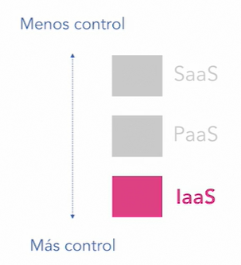

# Introducción

`Este examen, con código AZ-900, tiene como objetivo examinar si tenemos los conocimientos esenciales acerca del cómputo en la nube, específicamente su implementación en Microsoft Azure. De hecho, el nombre completo del examen es Microsoft Azure Fundamentals. Según su propia descripción, este examen está dirigido a personas con o sin conocimientos técnicos profundos.`

* [poster oficial de certificaciones](http://aka.ms/TrainCertPoster)

# Beneficios y consideraciones de usar servicios de la nube

## Alta disponibilidad

`Una de las ventajas que obtenemos al adoptar una nube como Microsoft Azure es la alta disponibilidad`

* **La disponibilidad es la capacidad que tiene un sistema para que esté disponible en cualquier momento que sea
  necesario.**
    * La disponibilidad es un atributo de calidad. En el contexto de la arquitectura de software, un atributo de calidad
      es una propiedad medible de un sistema, que nos indica qué tanto puede satisfacer los requerimientos iniciales
      establecidos. La disponibilidad generalmente se mide con un valor porcentual. Por ejemplo, una disponibilidad de
      99 % al año, significa 3,65 días que se contempla que el sistema no estará disponible. Claro, entre mayor sea este
      porcentaje, más disponible estará el sistema en cuestión.
* **Alta disponibilidad**
    * Para lograr una disponibilidad lo más alta posible, debemos usar un conjunto de tecnologías y consideraciones al
      momento de diseñar nuestras soluciones. Generalmente, esto es a través de llevar a cabo algunas tácticas, como la
      replicación o la redundancia. Uno de los objetivos que tiene la alta disponibilidad es eliminar los puntos únicos
      de fallos que pudiese tener nuestro sistema. Tener puntos únicos de fallos nunca es buena idea y es un sinónimo de
      sistemas frágiles. Implementar nociones de alta disponibilidad por nuestra cuenta no es una tarea sencilla, sin
      embargo, si utilizamos la nube, podemos hacerlo de una forma ágil y sin tantas complicaciones.

## Estabilidad y elasticidad

* **Escalabilidad es habilidad de un sistema para poder adaptarse a las cargas de trabajo que se requieren para poder
  efectuar algún tipo de proceso de cómputo**
    * Hay dos tipos de escalabilidad: la escalabilidad vertical y la horizontal. En el idioma inglés, estos términos son
      «scale up» y «scale out», respectivamente, ya que el examen de certificación AZ-900 está en el idioma inglés, es
      conveniente familiarizarnos con los términos originales.
        * escalabilidad vertical
            * En este tipo de escalamiento, agregamos más poder de cómputo al mismo equipo, generalmente un servidor o
              una máquina virtual. Aquí, con poder de cómputo me refiero a una CPU más poderosa o más memoria RAM
        * escalabilidad horizontal
            * En este tipo de escalamiento, agregamos más recursos, por ejemplo, agregamos más servidores o ejecutamos
              más máquinas virtuales para poder satisfacer la demanda de cómputo requerida.
* **OJO: el escalamiento estático tiene un problema fundamental y es que podemos llegar a desperdiciar el cómputo
  disponible.**
    * Gracias al advenimiento/llegada/aparición del cómputo en la nube, estos problemas pueden ser cosa del pasado
      debido a la **elasticidad**, justamente.

* **Elasticidad es la capacidad en la que puedes escalar tus recursos de cómputo de forma automática basándonos en
  métricas que pueden definir de una forma sencilla tanto tú como tu empresa**
    * Con la elasticidad de la nube ya no importa realmente la carga de trabajo que requieras en tu empresa, ya que los
      recursos de cómputo se escalarían automáticamente para satisfacer los requerimientos de dicha carga de trabajo,
      logrando una utilización de recursos de cómputo eficiente bajo demanda y mucho menos costoso.

## Agilidad del cómputo en la nube

* **El cómputo en la nube es una tecnología que ha impactado positivamente la manera en la que hacemos negocios.**
* **La nube nos permite agilizar nuestros procesos de negocio y nos habilita a competir de mejor manera en cualquier
  tipo de vertical.**
    * Imaginemos a dos amigos que después de varias charlas de planeación han decidido poner en marcha el plan de crear
      una startup. Esta startup es una tienda de productos propios de su región y país. La empresa tiene como objetivo
      inmediato adoptar la tecnología necesaria para abrir una tienda de comercio electrónico en línea. Si intentaran
      adquirir el hardware necesario para llevar a cabo este proyecto, les costaría demasiado dinero a esta startup
      recién creada y a los dos amigos que la fundaron. Esto sin contar el resto de gastos relacionados, como energía
      eléctrica o licencias de software, etcétera. No obstante, la agilidad que nos brinda el cómputo en la nube no
      tiene precedentes. La empresa podría usar servicios de bases de datos para almacenar la información de su tienda,
      identidad, para permitir o no permitir el acceso a la tienda en línea, mapas e información geográfica para la
      ubicación en tiempo real, inteligencia artificial y machine learning para predicciones de datos o, tal vez,
      utilización de servicios cognitivos, análisis de datos para conocer áreas de mejora en sus operaciones e, incluso,
      conexión con sistemas de terceros. Todo esto a un costo mucho menor. Por lo tanto, gracias a la agilidad del
      cómputo en la nube, podemos adaptarnos rápidamente a los cambios del mercado. Esta agilidad, sin duda alguna, es y
      será un gran diferenciador en cualquier tipo de negocio.

## Tolerancia a fallos y recuperación de desastres

`Entender los conceptos de tolerancia a fallos y recuperación de desastres no solamente te ayudará a pasar el examen de certificación AZ-900, sino que también te ayudará a tomar mejores decisiones técnicas al momento de diseñar soluciones basadas en la nube`

* **Tolerancia a fallos es la habilidad que tiene un sistema para poder continuar operando sin interrupción cuando haya
  alguna falla en alguno de sus componentes.**
    * Podemos decir que la tolerancia a fallos es una de las tácticas para lograr alta disponibilidad. (Estos dos
      conceptos están muy ligados)
    * Hay diversas cosas que podemos hacer para implementar la tolerancia a fallos. En el hardware, podemos usar
      servidores o máquinas virtuales adicionales que sean idénticas entre sí y hacerlas redundantes. En el software,
      podemos hacer uso de la replicación de datos. Por ejemplo, en el caso de la caída de una base de datos, el sistema
      inmediatamente usaría otra. También, en la infraestructura base de los centros de datos, existen nociones de
      tolerancia a fallos. Por ejemplo, múltiples fuentes de energía eléctrica para evitar basarse en una sola.

* **Recuperación de desastres es al plan para recuperar la información y sistemas después de un evento catastrófico,
  como por ejemplo, algún desastre de la naturaleza.**

## Principios de las economías de escala

`Este concepto se refiere a la habilidad de hacer las cosas más eficientemente. No solo por el hecho de hacerlas mejor, sino por el hecho de hacerlas a menor costo y, por lo tanto, ofrecerlas de forma más barata.`

* Pensemos este concepto como un círculo virtuoso. Si la empresa que ofrece el producto o servicio en cuestión lo ofrece
  de forma masiva, el costo por unidad, entonces, será menor. A su vez, entre más compres tú este producto o servicio,
  la empresa que lo ofrece tiene la opción de hacerlo todavía más barato. Como podrás escuchar en esta explicación
  sintetizada de las economías de escala, esto sin duda alguna beneficia a los clientes finales.

## Gastos de capital vs. gastos operativos

* **Gastos de capital (Capital Expenditure o CapEx) es la inversión de capital para el correcto desarrollo de las
  actividades de una empresa**
    * Estos gastos, generalmente por adelantado, tienen el objetivo de obtener un beneficio en el futuro. Algunos
      ejemplos de CapEx son los gastos en inmuebles, equipos de cómputo o maquinarias. Necesitamos calcular la duración
      que tendrá el equipo o máquina en cuestión. Por lo tanto, este tipo de inversiones CapEx son muy difíciles y
      dolorosas para nuevas empresas y/o startups.
    * Frecuentemente, CapEx es común en grandes empresas y corporaciones. Un ejemplo claro de CapEx es la compra de
      servidores en la empresa. Si bien esta tendencia ha ido a la baja debido a la democratización de las tecnologías
      de nube, aún hay empresas e instituciones que adquieren este tipo de equipos para instalarlos en sus propias
      inmediaciones

* **Gastos operativos (Operation Expenditure u OpEx) son los relacionados con la operación normal del día con día de una
  empresa**
    * Generalmente, se pueden adquirir con un modelo de pago por uso. Por ejemplo, la energía eléctrica o artículos de
      oficina son dos claros ejemplos de OpEx. Por estas razones, los gastos OpEx son ideales para cualquier tipo de
      empresa, gracias a sus bajos costos iniciales. Otro ejemplo de un gasto operativo u OpEx es, sin lugar a dudas, la
      nube. Al adoptar las tecnologías nativas de la nube, podemos reducir los gastos de capital, es decir, los gastos
      CapEx, e incrementar los gastos operativos u OpEx, gracias a su modelo de pago por uso y al tener siempre como
      opción el dejar de usarlos en cualquier momento cuando ya no los necesitemos.

## Modelo de facturación basado en consumo

`El modelo de facturación basado en consumo estámuy relacionado a los gastos operativos`

* **Con el modelo de facturación basado en consumo solamente pagamos pod ki que verdaderamente usamos**
    * Muy importante, sin gastos por adelantado, gracias a que no requieres comprar servidores y todo lo que conlleva la
      adquisición de esos equipos. El modelo de facturación basado en consumo que ofrece la nube es menos costoso, más
      ágil y mucho más cómodo.
    * No hay un compromiso permanente. A diferencia de la compra de servidores físicos, puedes dejar de usar los
      servicios de la nube en cualquier momento que tú decidas o modificar tus planes de consumo según la estrategia
      tecnológica que tenga tu empresa.

## Preguntas

* 
* 
* 
* 
* 

# Modelos de servicio de cómputo en la nube

## Infraestructura como servicio (IaaS)

`Con la infraestructura como servicio, rentamos, en pocas palabras, el hardware que está dentro de un centro de datos que, a su vez, está dentro de una región de Azure.
`

* **Ventajas**
    * Infraestructura como servicio (IaaS) es el modelo de servicio de cómputo en la nube más flexible/controlado de
      todos.
    * 
    * Con este modelo, contamos con toda la flexibilidad posible, ya que tenemos, prácticamente, todo el control del
      hardware que aprovisionemos.

* **Desventajas**
    * Esta flexibilidad antes mencionada, de hecho, también es su principal desventaja, ya que es nuestra
      responsabilidad total y completa el administrar y configurar todo. Desde el sistema operativo, la red, el
      almacenamiento, los parches del sistema operativo, Service Packs, respaldos, la seguridad, etcétera.

* **Ejemplos**
    * Un ejemplo de servicio de tipo IaaS en Azure son las máquinas virtuales, otro ejemplo serían the Virtual Machine
      Scale Sets, que también se consideran parte de este modelo de cómputo IaaS.

## Plataforma como servicio (PaaS)

`Si bien la infraestructura como servicio es el modelo de servicio de cómputo en la nube más flexible/controlado, regularmente, en las aplicaciones y soluciones nativas en la nube, es mejor optar por la plataforma como servicio o PaaS como ambiente para la construcción, pruebas y despliegue de aplicaciones.`

* **Plataforma como servicio (PaaS) son una serie de servicios pre-construidos que ofrece Azure para poder construir
  sofisticadas soluciones de cualquier tipo.**

* **Ventajas**
    * Uno de los grandes beneficios que tiene el modelo de plataforma como servicio es que no necesitamos administrar la
      infraestructura subyacente ni tampoco el sistema operativo, parches de seguridad, etcétera, lo que sí sucede en
      IaaS. Todo eso es responsabilidad del proveedor de nube, en este caso, Microsoft.
    * Otro beneficio importante es que todos los servicios de PaaS cuentan con el modelo de facturación de pago por uso.
    * es mucho más cómodo y robusto usar PaaS en vez de IaaS. (Dependiendo del caso de uso)

* **Desventajas**
    * el de no tener tanta flexibilidad/control como sí lo tiene IaaS.

* **Ejemplos**
    * En PaaS podrás encontrar una gran cantidad de servicios como, por ejemplo, Azure SQL Database, para bases de
      datos; Azure App Service, para servicios de hospedaje y ejecución de aplicaciones web, API, aplicaciones móviles y
      un largo etcétera.

## Software como servicio (SaaS)

* **Software como servicio (SaaS) es un modelo de servicio de cómputo en la nube que nos permite usar aplicaciones y
  sistemas completos a través de internet.**
    * Ese software que ofrece el proveedor está hospedado de forma centralizada y, generalmente, tiene una arquitectura
      «multi-tenant», esto es, que muchos clientes y empresas están usando la misma versión del software y, a su vez, el
      software es capaz de dar cabida a N número de nuevos usuarios y empresas. Nosotros como usuarios, simplemente,
      usamos la aplicación como cualquier otra.
    * Las soluciones de software basadas en SaaS, regularmente, se ofrecen a través de una suscripción de duración
      mensual, semestral o anual.

* **Ventajas**
    * Usamos la aplicación y ya, sin preocuparnos del mantenimiento y administración del hardware y plataforma
      subyacente. ( Bueno, esto es parcialmente cierto, ya que nosotros sí somos responsables de algo, esto se ve en el
      modelo de responsabilidad compartida)

* **Desventajas**
    * Ya que el proveedor es responsable prácticamente de todo en este modelo de servicio de cómputo en la nube, una
      desventaja que podemos mencionar aquí es el que la disponibilidad del servicio puede verse afectada debido a
      razones de mantenimiento que el proveedor haga en la plataforma.

* **Ejemplos**
    * Un ejemplo de SaaS es Office 365, Dynamics CRM Online, Microsoft Teams, etcétera.

## Modelo de responsabilidad compartida

`Este modelo se refiere a la responsabilidad de administrar las diversas capas y componentes que constituyen un modelo de servicio de cómputo en la nube.`

* 

* Por último, si vemos Saas, que es Software as a service, aquí el proveedor administra todo, absolutamente todo, desde
  la infraestructura hasta llegar a las aplicaciones. Claro está, según la explicación que dimos también de software as
  a service, pues tú eres responsable de administrar los datos que se introducen en el software como tal, no
  necesariamente a eso se refiere con datos en esta capa que tenemos en pantalla, solamente recuerda que en Saas, pues
  tú administras tu propia información, por ejemplo, en Office 365, tú administras todos los documentos que se estén
  subiendo en ese software.

# Modelos de cómputo en la nube

## Nube pública

* La nube pública es un modelo de despliegue que contempla el uso de una infraestructura compartida que ofrecen los
  proveedores de nube, en este caso, Microsoft. Este modelo de despliegue es el más común en el cómputo en la nube. La
  nube pública es un ambiente multi-tenant. Este término en inglés se refiere a que podemos tener un gran número de
  usuarios que estén usando la misma infraestructura; de hecho, tenant significa inquilino en inglés, por lo que
  entonces podemos decir que es un ambiente multi-inquilino.

* Este modelo permite a las empresas adoptar rápidamente la nube, ya que el proveedor ya tiene toda la infraestructura
  preparada y configurada de antemano.

* **Ventajas**
    * escalabilidad prácticamente ilimitada; esto obedece a que ya están disponibles para nosotros los recursos de
      cómputo que el proveedor tiene a nuestra disposición.
    * La nube pública nos brinda una agilidad única para poder adaptarnos rápidamente a los cambios en el mercado donde
      se encuentre nuestra empresa.
    * Gracias a su modelo de pago por uso, podemos controlar los costos de las soluciones de software que implementemos.
    * La nube pública ofrece una gran cantidad de funcionalidades con muy poco esfuerzo y conocimientos técnicos,
      principalmente, claro, si usamos los servicios de plataforma como servicio.
    * Nos ofrece un modelo de autoservicio.
        * ¿Qué significa esto? Significa que en cualquier momento que nosotros lo necesitemos, podemos hacer uso de una
          gran cantidad de recursos de cómputo y servicios, los cuales ya están listos para ser desplegados y usados.

* **Desventajas**
    * Tienes que ceder el control de la infraestructura a un tercero, en este caso, Microsoft; esto significa que el
      proveedor tiene todo el poder de decisión con respecto al hardware.
    * Adicionalmente, algunas empresas e instituciones gubernamentales, están regidas por regulaciones y leyes que les
      impiden el uso de una nube pública, sobre todo si esa nube está en un país diferente. Sin embargo, cada vez son
      más flexibles las leyes y gobiernos, y ya se están alineando a los cambios tecnológicos de nuestros tiempos.

## Nube Privada

* La nube privada es un modelo de despliegue del cómputo en la nube que tiene como objetivo brindar las prestaciones
  tecnológicas y beneficios de una nube pero de forma privada y exclusiva para la empresa.

* Una nube privada generalmente está hospedada en las inmediaciones de la empresa. A este modelo se le denomina On
  Premises en inglés.
    * También es posible que una nube privada la hospede una empresa de terceros, la cual proporciona los servicios de
      soporte técnico, mantenimiento y administración para dicha nube privada.

* Debido a su naturaleza de ser privada y dedicada exclusivamente a la empresa en cuestión, a este modelo de despliegue
  también se le conoce como single-tenant o uni-inquilino, si lo traducimos al español, ya que si bien puede dar
  servicio a N cantidad de usuarios, estos no dejan de pertenecer a la misma organización.

* **Ventajas**
    * Con una nube privada, generalmente se cumple todo tipo de regulación y requerimiento legal o gubernamental que
      pudiese tener que cumplir la empresa o institución de gobierno; esto debido a que tanto el hardware como los datos
      están dentro del territorio o región acorde a las leyes locales.
    * Tenemos control total de los recursos de cómputo y del hardware, razón por la que este tipo de nubes puede llegar
      a ser más segura que la nube pública.
        * Claro está, va a depender de muchos factores, como la infraestructura física, la correcta configuración del
          hardware y software y la pericia del staff de administración.

* **Desventajas**
    * El costo elevado frente a la nube pública
        * Este tipo de soluciones llegan a ser más costosas si las comparamos con su contraparte de nube pública
    * Tú eres el responsable de todo, la infraestructura base, los servidores, el almacenamiento, los sistemas
      operativos, respaldos, configuración, todo, todo está bajo tu responsabilidad.
    * Requieres contar con personal técnico calificado que tenga como rol el administrar y configurar tu nube privada;
      esto impacta asimismo el tema del costo que acabo de describir

## Nube híbrida

* Como su nombre lo indica, es una mezcla de ambas nubes pública y privada.
* En este modelo podemos ejecutar las aplicaciones en la nube privada y usar la nube pública para replicar los datos
  para su almacenamiento permanente o para exponerlos a otro tipo de aplicaciones públicas, como portales web o
  aplicaciones móviles.
    * O viceversa, podemos ejecutar algunas cargas de trabajo en la nube pública y, a la vez, estar comunicándonos a la
      nube privada para realizar algún tipo de sincronización o acceso a datos.

* **Ventajas**
    * Mejor soporte para sistemas heredados que la empresa esté pensando en modernizar próximamente.
        * Esto debido a que para algunas empresas la nube híbrida es el primer paso de la adopción de la nube como tal.
        * Una nube híbrida les permite adoptar la nube de forma paulatina.
    * Una nube híbrida, le permitiría a la empresa el reutilizar el hardware actual.
    * Una nube híbrida le daría a la empresa la flexibilidad de seleccionar dónde desplegar los recursos de cómputo.
        * Por ejemplo, una aplicación pública de comercio electrónico que esté hospedada en la nube pública, que esté
          accediendo a las bases de datos y sistemas de terceros desplegados en una nube privada.

* **Desventajas**
    * Este modelo de despliegue es más complicado de mantener, administrar y configurar, ya que ahora tienes dos nubes,
      la pública y la privada.
    * La nube híbrida puede llegar a ser más cara por lo mismo.
    * Requieres personal técnico altamente capacitado para poder afrontar los retos de administración y configuración de
      esta nube híbrida, impactando probablemente en el costo final.

* No es parte del temario del examen AZ-900, pero me gustaría terminar diciéndote que para las nubes híbridas Microsoft
  cuenta con Azure Stack, el cual es una familia de productos que tienen como objetivo el implementar este tipo de nubes
  de una forma lo más rápido posible. Si estás interesado, te invito a que conozcas más de Azure Stack aquí en LinkedIn
  Learning.

# Servicios y componentes principales en la arquitectura de Azure

## Geografías y regiones en azure

* Una geografía es un área que está deslindada, geográficamente hablando, y que puede contener una o varias regiones.
* Una geografía no necesariamente tiene una relación uno a uno con un país, aunque a veces suceda así
    * Estados Unidos como geografía tiene varias regiones
    * Canadá como geografía tiene varias regiones
* Una cosa muy importante de las regiones y geografías, entonces, es entender su relación. Podemos decir que una
  geografía puede tener N regiones, hay una relación de uno a varios entre geografías y regiones
* Es importante mencionar que podemos replicar los datos entre regiones, esa es una opción de alta disponibilidad que
  nos permite Azure.

* **Centros de datos o Data Centers**
    * Una región puede tener uno o varios, es decir, una geografía tiene una o varias regiones, una región tiene uno o
      varios Data Centers, que en pocas palabras, contienen el hardware, tienen esos cientos o miles de servidores donde
      nosotros podemos aprovisionar nuestros recursos de cómputo.
    * En el portal de Azure, y de hecho, usando cualquiera de las herramientas de Azure, no tenemos la opción de
      seleccionar tal o cual data center, tampoco la geografía, simplemente nosotros seleccionamos una región, eso es lo
      que nosotros podemos seleccionar como usuarios finales de esta nube de Microsoft.

* **Una geografía tiene o varias regiones, y en una región podemos encontrar uno o varios centros de datos.**

## [Zonas de disponibilidad en Azure](https://docs.microsoft.com/es-es/azure/availability-zones/az-overview)

* En tu examen de certificación AZ-900 aparecerá este tema de zonas de disponibilidad, ya que es una de las maneras que
  usa Azure para brindar alta disponibilidad dentro de una región.

* Una zona de disponibilidad es un centro de datos completamente independiente de otro centro de datos, es decir, cada
  una de estas zonas de disponibilidad tienen su propio mecanismo de energía eléctrica, sus propios mecanismos de
  enfriamiento, todos los sistemas necesarios para poder funcionar están independientes uno de otro.
    * Esto es sumamente importante, ya que una zona de disponibilidad dentro de la misma región puede caerse, sin que
      eso afecte el resto de zonas de disponibilidad dentro de la misma región.

* También es importante mencionar que hay, por lo menos, tres zonas de disponibilidad en cada región, en aquellas
  regiones donde estén soportadas, ya que no todas las regiones tienen el soporte de zonas de disponibilidad.

* Podemos ver la lista de aquellas regiones donde sí hay zonas de disponibilidad, y también vemos en la matriz que para
  qué productos hay zonas de disponibilidad.

* Hay dos categorías de servicios que soportan zonas de disponibilidad (esto lo tienes tú que configurar y diseñar
  explícitamente cuando estés creando algún tipo de recurso en Azure.)
    * Servicios zonales: Estos son recursos que son puestos en una zona de disponibilidad explícitamente.
        * Por ejemplo, las máquinas virtuales o los discos manejados o las direcciones IP son algunos ejemplos de este
          tipo de servicios zonales.
    * Servicios redundantes de zona: son aquellos que Azure replica sus datos automáticamente entre zonas de
      disponibilidad.
        * Un ejemplo claro de este tipo de servicios es Azure SQL Database. Azure SQL Database es capaz de replicar
          automáticamente entre dos diferentes zonas de disponibilidad.

## Grupos de recursos en Azure

* Los grupos de recursos en Azure son contenedores lógicos para que podamos poner ahí cualquier tipo de recurso de
  cómputo que decidamos aprovisionar, y me refiero a lógico, ya que no necesariamente es algo que se despliegue en algún
  servidor, simplemente, es para administrar de forma lógica todos los recursos que están dentro de este grupo como una
  sola entidad.
    * Por ejemplo, para controlar los costos de todos los recursos que están en un solo grupo, es más fácil hacerlo de
      esa manera.

## Azure Resource Manager

`Cuando desplegamos recursos de cómputo o los administramos a través de alguna herramienta, como por ejemplo, el portal de Azure o la línea de comandos o PowerShell, etc., en realidad, siempre estamos interactuando con el Azure Resource Manager.`

* El Azure Resource Manager es el responsable de la interacción con los servicios de Azure.
    * Es esta interfaz consistente y predecible, que es responsable de la interacción con los servicios de Azure.

* A su vez, esta pieza de infraestructura que tiene la nube de Microsoft usa subyacentemente estos proveedores de
  recursos. Puedes pensar un proveedor de recurso como las clases que puedes instanciar en beneficio de la funcionalidad
  que quieras tú desplegar.

* 

* Por ejemplo, cuentas de almacenamiento o máquinas virtuales o App Services o Azure SQL Database, etc., etc. En
  realidad, cada uno de los servicios que están dentro de Azure que puedes aprovisionar, tienen un proveedor de recurso
  relacionado. Por ejemplo, en el caso del Virtual Machine, el proveedor de recursos es Microsoft. Compute, mientras que
  el de App Service es Microsoft. Web, ese es el nombre técnico de este proveedor.

* Entonces, Azure Resource Manager utiliza estos proveedores de recursos para poder desplegar recursos dentro de nuestra
  suscripción y, además, para poder administrarlos. ¿Cómo lo hace esto? Bueno, lo hace de una manera muy sencilla. En
  realidad, Azure Resource Manager expone una API de tipo REST, que nosotros podemos invocar. Incluso podríamos crear
  una aplicación manualmente que invocara a esta API. Sin embargo, pues ya para eso existe la API pre-construida que nos
  brinda Azure.

* Por lo tanto, esta API REST, para poder interactuar con él, lo que hacemos es enviar documentos de tipo JSON.

* En el mundo de Azure Resource Manager estos documentos JSON se llaman ARM Templates o Azure Resource Manager
  Templates, en español, plantillas del Azure Resource Manager.

* En una plantilla del Azure Resource Manager vamos a encontrar, en primer lugar, esta sección de Parameters, la cual
  define los inputs que queremos pasar a la plantilla. Posteriormente, vamos a encontrar Variables que, como su nombre
  lo indica, son los valores que podemos usar en toda la plantilla, es como cuando declaras una variable en los
  lenguajes de programación. Seguido de esta sección llamada Resources, que es el lugar donde definimos la lista de
  recursos que queremos desplegar o actualizar. Si vemos aquí, en Resources, pues está el proveedor de recursos llamado
  Microsoft. Storage, específicamente, storageAccounts de este proveedor de recursos y acá un proveedor de recursos
  puede tener N cantidad de diferentes recursos internamente. Y finalmente tenemos en la parte de abajo y de forma
  opcional, la parte de Outputs. En este caso, esta plantilla parece ser que no tiene outputs, pero es importante que
  sepas que está esta otra sección, que va a enlistar los valores que retorna después de ejecutar.

* Los ARM Templates te permiten declarar dependencias entre los diferentes recursos. Por ejemplo, una aplicación web,
  imagínate que tienes este front end hecho con algún lenguaje de programación y lo vas a desplegar, por ejemplo, en un
  App Service, pero requieres una base de datos, por ejemplo, Azure SQL Database. Por lo tanto, puedes declarar que para
  la aplicación web hay una dependencia, que es la base de datos, todo eso lo puedes indicar aquí adentro de la
  plantilla ARM.

* ¿Por qué se vincula DevOps con los ARM Templates?
    * Pues porque están íntimamente ligados, debido a que este tipo de documentos declarativos es la base para el
      concepto de infraestructura como código dentro del tema grande de DevOps.

## Conjuntos de disponibilidad en Azure (Availability sets)

* Los conjuntos de disponibilidad en Azure, es una característica que nos permite protegernos de eventos de
  mantenimiento a la infraestructura, ya sean eventos programados o no, así como de fallas que pudiesen suceder en los
  servidores o en hardware relacionado.

* Microsoft garantiza una disponibilidad del 99,95 % con esta característica de los conjuntos de disponibilidad.

* Un conjunto de disponibilidad es una funcionalidad de agrupación lógica para poder aislar las máquinas virtuales entre
  sí cuando estas son desplegadas. Por lo tanto, necesitamos más de una máquina virtual para que pueda funcionar este
  concepto de los conjuntos de disponibilidad.

* Azure usa un concepto llamado los «Fault domains» que es un concepto lógico que representa un rack físico de
  servidores, es decir, hay una relación uno a uno entre un fault domain y un rack de servidores.

* 

* Necesitamos dos fault domains como mínimo para que esta característica de los conjuntos de disponibilidad funcione. Si
  vas a desplegar, por ejemplo, dos máquinas virtuales en un conjunto de disponibilidad, una máquina se desplegaría en
  el Fault domain 0 y otra máquina se desplegaría en el Fault domain 1. Esto te ayuda, ya que si hay una falla en el
  rack 2, digamos, el rack 2 de servidores físicos, pues siempre queda la opción que uses el rack 1, es decir, tu
  solución de software quedaría disponible. No así, si despliegas las dos máquinas virtuales en el mismo rack.

* 

* Ahora, también esta característica de los conjuntos de disponibilidad se basa en otro concepto llamado los Update
  Domains, o dominios de actualizaciones que son usados cuando una máquina debe reiniciarse. Esto debido a que Azure se
  va a asegurar de únicamente reiniciar las máquinas de un solo update domain a la vez, ¿para qué? para que justamente
  tu solución de software siga estando disponible.

# Recursos de cómputo en azure

* Los recursos y servicios de esta categoría proporcionan poder de cómputo, por eso su nombre, para poder ejecutar
  nuestras aplicaciones.

* La zona de disponibilidad, es un mecanismo para poder implementar alta disponibilidad y poder hacer una recuperación,
  por ejemplo, de un desastre cuando un centro de datos en la misma región, pues le sucede algo.

## Conceptos esenciales de máquinas virtuales

* Las máquinas virtuales son uno de los servicios principales de la categoría de cómputo en Azure.

## Configuración y conexión remota a una máquina virtual

## Conceptos esenciales de Virtual Machine Scale Sets

* Virtual Machine Scale Sets son un grupo de máquinas virtuales idénticas entre sí, creadas a partir de una misma imagen

* Estas máquinas virtuales una vez creadas son idénticas, pero pueden irse modificando debido a que están dejando algún
  tipo de archivo o la configuración se está modificando. De ahí que herramientas como PowerShell, Desired State
  Configuration nos ayudan a asegurarnos que siempre estén con tal o cual estado que nosotros especifiquemos.

## Conceptos esenciales de Azure App Service

* Otro de los servicios que caen en la categoría de cómputo o procesamiento es el de Azure App Service; sin embargo,
  este es del modelo de plataforma como servicio, a diferencia de las máquinas virtuales (virtual machine) y el conjunto
  de escala de máquinas virtuales (Virtual Machines Scale Set) que son de infraestructura como servicio.

* Un App Service te permite hospedar cualquier tipo de aplicación basada en tecnologías web, independientemente de qué
  tecnología hayas usado para construir esa aplicación web; llámese .NET, Java, Gold, Ruby, Python, PHP, etc. todo está
  soportado, si no directamente en el «run time» de los Apps Services, sí a través de contenedores.

* En un mismo plan, puedes desplegar diferentes (App Services), ese es la relación entre uno y otro.

## Contenedores con Azure Container Instances

* Cada vez es más común utilizar contenedores para la modernización de aplicaciones o para la creación de nuevos
  sistemas basados en tecnologías nativas de la nube.

* En Azure vamos a poder encontrar diferentes servicios que soportan los contenedores.

* Container VS Virtual Machines
    * En este diagrama se comparan los contenedores con las máquinas virtuales. En las máquinas virtuales nosotros
      instalamos un sistema operativo completo, llámese Windows Server o Windows 10, o Ubuntu o CentOS o Debian, el que
      sea, pero la máquina virtual contiene un sistema operativo que un componente, llamado el hypervisor, es el
      responsable de poder ejecutar en una infraestructura base.
    * A diferencia de las máquinas virtuales, los contenedores utilizan y aprovechan directamente el sistema operativo
      instalado en la infraestructura base, por lo tanto, los contenedores son mucho más ligeros.
    * También promueven una mayor densidad de cómputo, esto quiere decir que se aprovechan mucho mejor los recursos de
      cómputo actuales en la infraestructura actual, debido a que justamente al ser más ligeros y más pequeños estos
      procesos, podemos ejecutar más contenedores en la misma máquina si lo comparamos con el uso de una máquina
      virtual.
* 

## Contenedores con Azure App Service

* Otro servicio que soporta contenedores es Azure App Services.

* Azure Container Instances VS Azure App Service
    * ¿Cuándo usar uno o cuándo usar otro?
        * Azure Container Instance, personalmente lo considero un servicio de tipo serverless, ya que únicamente
          Microsoft está cobrando por el tiempo de ejecución de dicho contenedor, mientras que la App Service está
          corriendo todo el tiempo.

        * Azure Container Instances, en realidad, se considera «platform as a service», es decir, plataforma como
          servicio, sin embargo, por sus características de pago por uso y aprovisionamiento dinámico yo lo considero
          uno de los servicios serverless que tiene Azure.

        * Azure Container Instances no puede escalar, esa sería la desventaja, mientras que con App Services, tú puedes
          escalar de forma manual, aprovisionando más máquinas virtuales según el plan del App Service que tengas o de
          forma automática.

## Test

* 
* 
* 
* 
* 
* 

# Recursos de redes en Azure

* 

* En este diagrama, vamos a explicar qué es lo que vamos a construir a lo largo de este módulo de este curso. Lo primero
  que vamos a aprovisionar es un grupo de recursos donde vamos a desplegar todos los diferentes recursos, como la
  máquina virtual, la interfaz de red, la dirección IP pública, etcétera. En este grupo de recursos, entonces, vamos a
  desplegar una VNet, o red virtual, la cual tendrá una «subnet», o subred, en español, y esta subred la vamos a
  proteger a través de un Network Security Group. Esto, para asegurarnos que solamente el tráfico de cierta dirección IP
  y de cierto puerto pueda entrar a esta red. Posteriormente, vamos a crear la máquina virtual, que va a estar
  relacionada con una cuenta de almacenamiento que vamos a desplegar también. En esta cuenta de almacenamiento que vamos
  a desplegar, vamos a guardar todos los logs de diagnósticos de la máquina virtual. Además, la máquina virtual tiene un
  disco donde se va a desplegar el sistema operativo, en este caso, vamos a utilizar Windows Server 2019, pero el mismo
  ejemplo lo pudieras utilizar para cualquier otro sistema operativo. Además, vamos a desplegar una interfaz de red que
  está relacionada con esta máquina virtual y que se conecta a la subred. Finalmente, vamos a desplegar también una
  dirección IP pública, la cual será la responsable de exponer la máquina virtual hacia el internet, pero cumpliendo,
  obviamente, las reglas del Network Security Group que hayamos especificado.

## Creación de la red virtual (VNET)

## Creación del Network Security Group (NSG)

* Los «network security groups» o grupos de seguridad de red y lo podemos traducir al español, son estos recursos que
  nos aseguran la protección de los recursos de red, basándonos en reglas de quién sí puede entrar y con qué dirección y
  a qué puertos pueden entrar, tanto de entrada como de salida.

## Escenario: Creación de un Load Balancer

* Load Balancers, los cuales son recursos que nos permiten enrutar el tráfico hacia los diferentes recursos que tenemos
  en Azure.

* Hay prácticamente tres tipos de Load Balancing o balanceadores de cargas en Azure. El primero es el Load Balancer, así
  se llama este recurso que incluso es el que vamos a hacer en el resto de este módulo. Este Load Balancer es el más
  común de todos, y se basa en la capa 4. Por su parte, también tenemos Application Gateway el cual está relacionado con
  la capa 7, la capa de aplicación, y este tiene como objetivo acceder a un reverse proxy y está relacionado
  principalmente para el tráfico web. Si vas a utilizar enrutamiento para el tráfico web, probablemente el application
  gateway sea una mejor opción. Y también Traffic Manager, el cual trabaja a nivel de los DNS. Entonces, para explicar
  qué es lo que vamos a construir aquí en este escenario, vamos a mostrar el siguiente diagrama.

## Configuración del Network Security Group

* En este momento ya tenemos nuestro, Load Balancer creado aquí en el grupo de recursos llamado curso-az-900-lb, es este
  recurso que está aquí, con tipo Equilibrador de carga. También podemos ver que está la dirección IP pública que
  decidimos crear cuando aprovisionamos el Load Balancer. Lo interesante en este momento es ver cuál es la dirección IP
  pública que le asignó Azure a el Load Balancer. Podemos ver que es esta: 157.55.81.22. Por lo tanto, una prueba que
  podemos hacer en este momento es abrir una ventana de navegador y dirigirnos hacia esta dirección IP pública. Aquí
  tenemos esta nueva ventana de navegador y, como podrás observar, escribí la dirección 157.55.81.22, que es la
  dirección pública. Sin embargo, algo sucede, porque no estoy recibiendo ningún tipo de respuesta por parte de las
  máquinas virtuales, que se supone que están siendo el pool de máquinas virtuales subyacente del Load Balancer. Esto
  obedece a que necesitamos abrir el puerto 80 en el Network Security Group, relacionado con el adaptador de red. Por lo
  tanto, vámonos de regreso al portal. Aquí, en el portal, entonces, vámonos hacia el grupo de recursos. Vamos a
  seleccionar el Virtual Machine Scale Set. Y aquí, en Redes, puedes observar que tenemos este botón llamado Agregar
  regla de puerto de entrada. Por comodidad, voy a hacer clic aquí. Esto lo pude haber hecho si me iba hacia la interfaz
  de red, pero para que notes cuál es la relación entre el Virtual Machine Scale Set y la red y la interfaz de red.
* Entonces, si viene de cualquier origen, con cualquier tipo de puerto de origen, destino cualquiera. Vamos a ponerle
  puerto 80, porque se trata de servidores web. La prioridad 100 está bien, y vamos a ponerle de nombre Puerto 80. Con
  esto, debería ser suficiente, entonces, para permitir el tráfico hacia el puerto 80 de los diferentes web servers que
  están dentro del Virtual Machine Scale Set. Aquí ya la regla de seguridad se creó correctamente, incluso aparece en la
  lista. Por lo tanto, vamos a regresarnos al browser que teníamos abierto. Aquí tenemos nuevamente el navegador, por lo
  tanto, vamos a, nuevamente, hacer la petición hacia esta dirección IP pública, pulsando la tecla Enter. Como puedes
  observar, me está regresando ese «Hola, Mundo», indicándome que este servidor 0, es quien me está respondiendo. Si
  vemos en el portal las instancias, aquí en las instancias del Virtual Machine Scale Set, verás que tengo uno con
  identificador 0, otro con un 1 y otro con un 2, debido a que decidí tener tres virtual machines dentro de este scale
  set. Por lo tanto, quien me está respondiendo es el 0. Para hacer otra prueba, vamos a abrir la terminal. Y aquí en la
  terminal vamos a usar la herramienta curl para hacer la petición hacia 157.55.81.22, a ver qué nos regresa. Y como
  podrás observar acá arriba, donde dice Content, quien me está respondiendo en este momento es el servidor 1, es decir,
  la máquina virtual que tiene el identificador número 1, diferente al del browser. Esto debido a las reglas del Load
  Balancing que tiene configuradas en este momento el Load Balancer que aprovisionamos. Como podrás observar, el
  balanceado de cargas es sumamente poderoso y estoy seguro de que en tu examen de certificación AZ-900 verás estos
  temas en alguna de sus preguntas.

## Test

* 
* 
* 
* 

# Recursos de Almacenamiento

## Servicio de Azure Storage

* Azure Storage es un servicio en Azure que nos permite almacenar datos de diferentes naturalezas
* Con respecto a la Replicación, esto es interesante, ya que hay diferentes opciones que podemos utilizar. Resulta que
  la cuenta de Azure Storage, este servicio de Azure va siempre a replicar tres veces los datos en la misma región para
  evitar problemas de alguna contingencia o algún error o incluso desastre natural. Por lo tanto, necesitas seleccionar
  la estrategia de replicación adecuada. Veamos la primera, Almacenamiento con redundancia local. Esta es una copia de
  forma síncrona que hace Azure Storage de tus datos. Los va a copiar tres veces en la misma ubicación dentro de la
  misma región, es decir, no van a salir los datos a otra región diferente, se van a quedar ahí y los va a copiar tres
  veces. Esta es la opción, digamos, la más barata de todas. La que sigue, está aquí que está en la lista,
  Almacenamiento con redundancia geográfica, nos permite copiar los datos en otra región par o que se considere par de
  la región principal. Si necesitas conocer cuáles son las regiones que forman un par, pues esto va a depender de la
  geografía y te invito a que consultes la documentación relacionada en docs.microsoft.com. Entonces, este tipo de
  replicación lo que hace es copiar los datos a otra región, ¿sí? Los datos ya no van a estar únicamente en la región
  principal, sino que van a estar en otro lado. Lo cual, si lo piensas, tiene sentido para evitar un desastre natural
  que afecte a toda una región, caso que ya sucedió en el pasado, específicamente, justamente en Centro-Sur de EE. UU.
 Hay otra más, recuerda que estas están aquí directamente vinculadas a la región. Antes de cambiarme de región para
  explicar otra, voy a seleccionar esta de Almacenamiento con redundancia geográfica, pero con acceso de lectura, es
  exactamente lo mismo a lo que acabo de explicar, de copiar los datos en otra región que se considere par a la región
  principal, sin embargo, solamente para acceso de lectura.

## Servicio de Blobs en Azure Storage ( es como el S3 de AWS)

## Servicio Archivo en Azure Storage

* File Service, que es un servicio para compartir folders y archivos, tal cual como lo hacemos si tenemos un servidor de
  archivos en nuestra empresa y queremos compartir una estructura de folders y archivos para ciertos usuarios, que esté
  centralizado y que todos los usuarios los puedan ver.

## Servicio de Colas en Azure Storage

* ¿qué es eso de colas de mensajes? Estas son mensajes que puedes tú enviar entre aplicaciones. Este es un servicio que
  generalmente se utiliza en aplicaciones distribuidas para el envío y recepción de mensajes de forma asíncrona debido a
  que el examen de certificación AZ-900 no es un examen de certificación para desarrolladores de software como tal,
  pues, hasta aquí vamos a dejar la explicación de las colas de mensajes.

* Lo que sí quiero destacar es que una de estas colas, que, por cierto, vamos a crear aquí, puede tener hasta 64
  kilobytes de tamaño y millones de mensajes.

## Servicio de Tablas en Azure Storage

* Otro tipo de almacenamiento que podemos encontrar en las cuentas de Azure Storage son las tablas. Estas tablas son
  interesantes, ya que son de tipo NoSQL, es decir, Not Only SQL que es ese el acrónimo de ese tipo de tecnologías, las
  cuales te permiten guardar datos sin que se exija un esquema como tal, cosa que sí sucede, por ejemplo, en las Bases
  de datos relacionales,