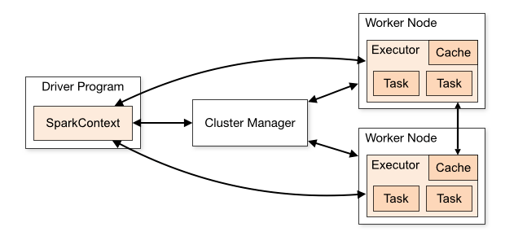
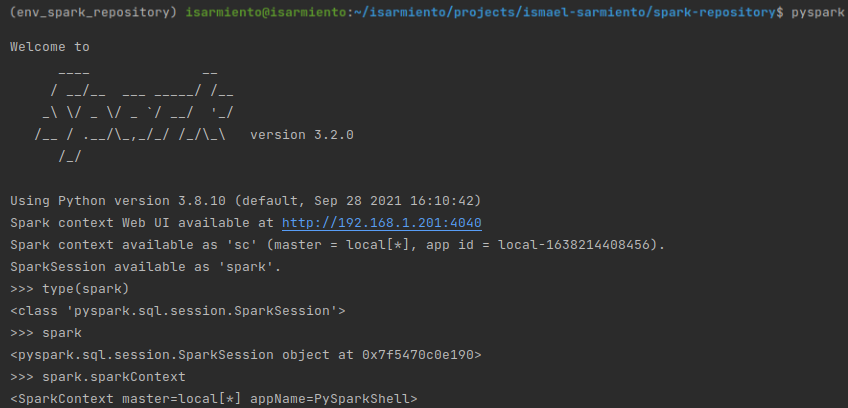
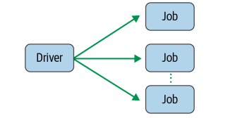
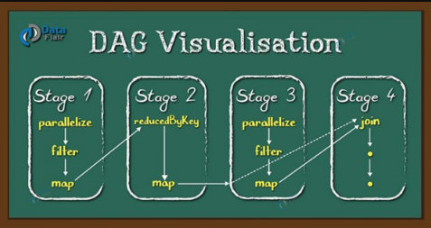
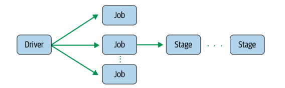
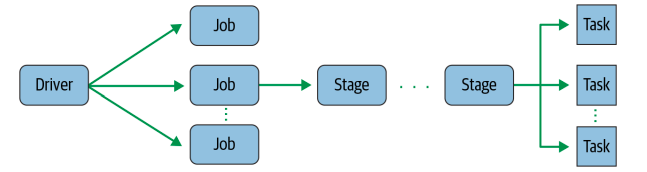
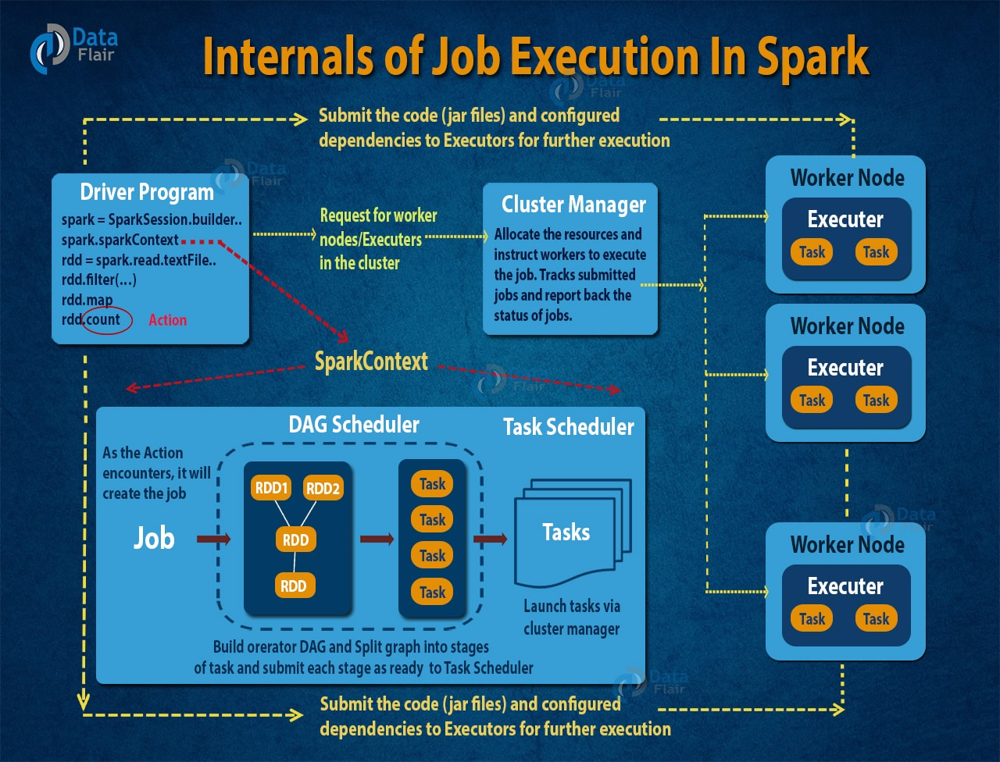
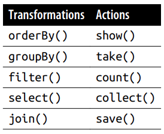
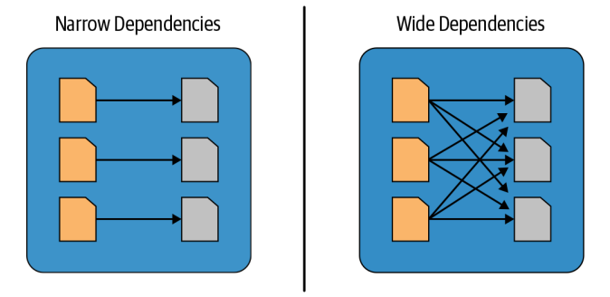

# [Apache Spark](https://projects.apache.org/project.html?spark)

## Arquitectura

### Diagrama General

* Las `spark-applications` se ejecutan como conjuntos independientes de procesos en un clúster, coordinados por el
  `spark-context` del `driver-program`.
* Para ejecutarse en un clúster, `spark-context` puede conectarse a varios tipos de administradores de clúster (ya sea
  el administrador de clúster independiente de Spark [`standalone-cluster-manager`], Mesos, YARN o Kubernetes), que
  asignan recursos entre `applications`.
* Una vez conectado, Spark adquiere `executors` en los nodos del clúster, que son procesos que ejecutan cálculos y
  almacenan datos para su `application`.
* A continuación, envía el código de su `application` (definido por archivos JAR o Python pasados al `spark-context`) a
  los `executors`.
* Finalmente, `spark-context` envía `tasks` hacia los `executors` para que las ejecuten.

* Cada `applications` tiene sus propios procesos `executors`, que permanecen activos durante toda la `applications` y
  ejecutan
  `tasks` en varios subprocesos. Esto tiene la ventaja de aislar las `applications` entre sí, tanto en el lado de la
  programación (cada controlador programa sus propias `tasks`) como en el lado del ejecutor (las `tasks` de diferentes
  `applications` se ejecutan en diferentes JVM). Sin embargo, también significa que los datos no se pueden compartir
  entre diferentes `spark-applications`  (instancias de `spark-context`) sin escribirlos en un sistema de almacenamiento
  externo.

* Spark es independiente del administrador del clúster subyacente. Siempre que pueda adquirir procesos `executors` y
  estos se comuniquen entre sí, es relativamente fácil ejecutarlo incluso en un administrador de clúster que también
  admita otras `applications` (e.g, Mesos / YARN / Kubernetes).

  

## Componentes

### Spark Application [`application`]

* Programa de usuario construido sobre Spark. Consta de un driver program y `executors` [`executors`] en el clúster.

### Spark Driver Program [`driver-program`]

* En el núcleo de cada `application` se encuentra el `driver-program`, el encargado de la creación del punto de acceso a
  spark: `spark-context` o `spark-session`
* Cuando se trabaja con la `spark-shell` el `driver-program` es parte de la shell y la `spark-session` se crea para
  usted con la configuración por defecto
  

### Spark Jobs [`jobs`]

* El `driver-program` convierte a la `application` en uno o más `jobs`. Luego, transforma cada trabajo en un `DAG`,
  este, en esencia es el plan de ejecución de spark, donde cada nodo dentro de un `DAG` podría ser una o varias `stages`
  de spark

  

### Spark Stages [`stages`]

* Como parte de los nodos `DAG`:

  

  las `stages` se crean en función de las operaciones que se pueden realizar en serie o en paralelo. No todas las
  operaciones de Spark pueden suceder en una sola `stage`, por lo que pueden dividirse en varias
  `stages`. A menudo, las `stages` se delinean en los límites de cálculo del operador, donde dictan la transferencia de
  datos entre los `executors` de spark.

  

### Spark Tasks [`tasks`]

* Cada `stage` se compone de `tasks` (una unidad de ejecución), que luego se federan/distribuyen en cada `executor` de
  Spark; cada `task` se asigna a un solo núcleo y funciona en una sola partición de datos. Como tal, un `executor` con
  16 núcleos puede tener 16 o más tasks que trabajan en 16 o más particiones en paralelo, lo que hace que la ejecución
  de las spark-tasks sean extremadamente paralelas.

  

## Diagrama General - Detallado

## Transformations, Actions and Lazy Evaluation

* Las operaciones de spark sobre datos distribuidos se pueden clasificar en dos tipos:
    * `transformations`: operaciones que transforman un `spark-df` en un nuevo `spark-df` sin alterar los datos
      originales, dándole la propiedad de inmutabilidad. Todas las transformaciones son evaluadas de forma `lazily`
      /diferida, es decir, que sus resultados no se computan de inmediato, sino que se registran o recuerdan como
      un `linaje`. Un `linaje`registrado permite a spark (en un momento posterior a su plan de ejecución) reorganizar,
      compensar u optimizar ciertas transformaciones en `stages` para una ejecución más eficiente.
    * `actions`: Una acción desencadena la `lazy-evaluation` de todas las transformaciones registradas y permite la
      ejecución de la `query-plan` de spark.

      

* Las acciones y transformaciones contribuyen a la `query-plan` de spark
* Si bien la `lazy-evaluation` permite que Spark optimice sus consultas al observar sus transformaciones encadenadas, el
  linaje y la inmutabilidad de los datos brindan tolerancia a fallos.
* Debido a que Spark registra cada transformación en su linaje y los DataFrames son inmutables entre las
  transformaciones, puede reproducir su estado original simplemente reproduciendo el linaje registrado, lo que le otorga
  resistencia en caso de fallos.

### Narrow and Wide Transformations

* Las transformaciones son operaciones que Spark evalúa de manera `lazy` (perezosa). Una gran ventaja del esquema de
  evaluación perezosa es que Spark puede inspeccionar su consulta computacional y determinar cómo puede optimizarla. La
  optimización se puede realizar uniendo o canalizando algunas operaciones y asignándolas a una `stage`, o dividiéndolas
  en `stages` determinando qué operaciones requieren `shuffle` mezcla o intercambio de datos entre clústeres.
* Las transformaciones se pueden clasificar en dependencias estrechas o dependencias
  amplias. `narrow or wide transformations`.
    * `narrow`: cualquier transformación en la que se pueda calcular una única partición de salida a partir de una única
      partición de entrada.
        * e.g: `filter() and contains()` representan transformaciones `narrow` estrechas porque pueden operar en una
          sola partición y producir la partición de salida resultante sin ningún intercambio de datos.
    * `wide`: cualquier transformación que requiera un intercambio de información entre particiones.
        * e.g: `groupBy() and orderBy()` le indican a Spark que realice transformaciones `wide` amplias, donde los datos
          de otras particiones se leen, combinan y escriben en el disco. Dado que cada partición tendrá su propio
          recuento de la palabra en su fila de datos, un recuento (groupBy()) forzará un `shuffle` de datos de cada una
          de las particiones del ejecutor en el clúster y (orderBy()) requiere de la salida de otras particiones para
          calcular la agregación final.

  

## FAQs

* [spark-context vs spark-session](https://sparkbyexamples.com/spark/sparksession-vs-sparkcontext/)
* [repartition-vs-coalesce](https://sparkbyexamples.com/spark/spark-repartition-vs-coalesce/)
    * **repartition**: se usa para aumentar o disminuir las particiones o redistribuir los datos de todas las
      particiones.
      Es una mezcla completa que conduce a una operación muy costosa cuando se trata de miles de millones y billones de
      datos.
    * **coalesce**: se usa solo para reducir la cantidad de particiones.Esta es una versión optimizada o mejorada de
      repartition()donde el movimiento de los datos a través de las particiones es menor usando coalesce.

## [Glossary](https://spark.apache.org/docs/latest/cluster-overview.html#glossary)

| Término  | Significado |
|---|---|
| application | Programa de usuario construido sobre Spark. Consta de un driver program y `executors` [`executors`] en el clúster. |
| driver-program | Proceso que ejecuta la función principal de la application y crea el spark-context |
| [spark-context](https://sparkbyexamples.com/spark/sparksession-vs-sparkcontext/#sparkcontext) | Objeto que proporciona un punto de entrada para interactuar con la funcionalidad subyacente de Spark y permite programar Spark mediante la api SparkRDD |
| [spark-session](https://sparkbyexamples.com/spark/sparksession-vs-sparkcontext/#sparksession) | Objeto que proporciona un punto de entrada para interactuar con la funcionalidad subyacente de Spark y permite programar Spark mediante la api de SparkSql. En una spark-shell interactiva, el spark-driver [`driver program`] del mismo crea su propia instancia de SparkSession, mientras que en una spark-application [`Application`] creada por usted, usted es el responsable de crear este objeto/instancia de SparkSession ) |
| job | Un cálculo paralelo que consta de varias `stages` que se generan en respuesta a una acción de Spark (e.g. save, collect) |
| stage | Cada `job` se divide en conjuntos más pequeños de `tasks` llamadas `stages` que dependen unas de otras (similar al `map and reduce` `stage` en MapReduce) |
| task | A unit of work that will be sent to one `executor` |
| cluster-manager | Un servicio externo para adquirir recursos en el clúster (e.g, standalone manager, Mesos, YARN, Kubernetes) |
|  lazy-evaluation | La evaluación diferida es la estrategia de Spark para retrasar la ejecución hasta que se invoca una acción o se "tocan" datos (se leen o se escriben en el disco). |
|   |   |

## Reference Links

* [Data Flair - Spark Tutorial](https://data-flair.training/blogs/spark-tutorial/)